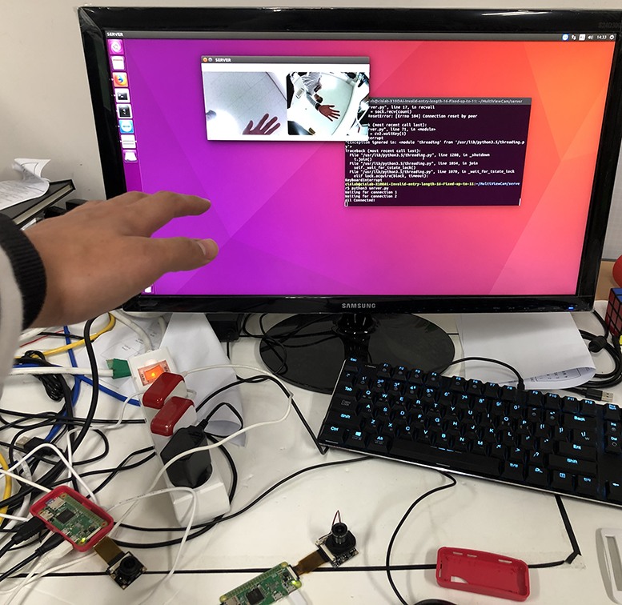

# MultiViewCam
 

Getting camera images from multiple RasberryPi zero cameras.

## Configuration
* 1 Server preferably Ubuntu
* 2 RasberryPi Zero with camera
* Those 3 devices are recommended to be in the same network.

## Requirements
### Server
* OpenCV python

### RasberryPi Zero
* PiCamera
* OpenCV python

OpenCV can be installed on RasberryPi Zero through this guide https://yoursunny.com/t/2018/install-OpenCV3-PiZero/

## Setup RasberryPi Zero
* git clone or download the project
* edit client2.py TCP_IP as the server's IP
* edit TCP_PORT to 5001 and the other one is 5002

## Run
* run client/client2.py on the rasberry pi
* run server/server.py on the server

Enjoy!
